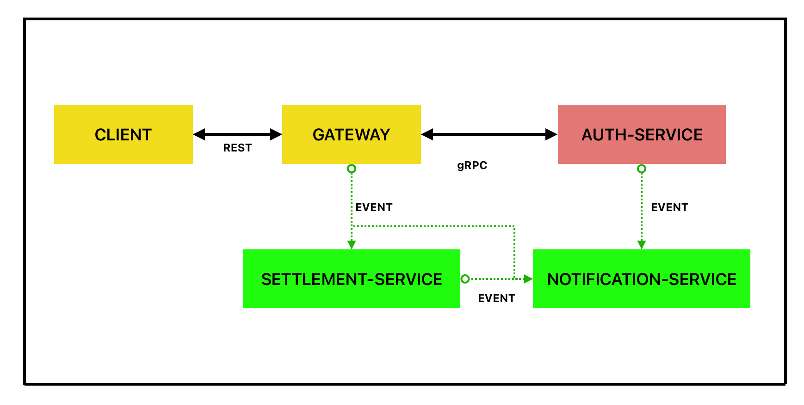

## CASH-FISH 
**A Payment-Service Api.**
*A scalable payment processing system built with Go, PostgreSQL, Kafka, implementing event-driven architecture patterns for reliable financial transactions.*

## Getting Started
- ***gRPC*** (API Layer)
- ***PostgreSQL*** (Primary Database)
- ***Kafka*** (Event Broker)
- ***MailHog*** (Email Testing Service)

##### CLIENT To GATEWAY: **REST** 
**Why? 
The client (web, mobile, or third-party app) communicates with the system through REST endpoints. REST is a widely adopted, simple, and accessible interface for external clients, especially when browsers or public APIs are involved.**

##### GATEWAY To AUTH-SERVICE: **GRPC**
**Why? 
Authentication is latency-sensitive. Using gRPC ensures fast, efficient, binary communication for verifying credentials. This reduces login wait time, enabling users to authenticate and begin using services quickly.**
##### GATEWAY To SETTLEMENT-SERVICE: **EVENT**
**Why? 
Settlement operations are asynchronous by nature and should not block user interaction. By sending requests as Kafka events the gateway can respond immediately, without waiting for settlement processing.The system becomes resilient to temporary service downtime also Events are stored and replayed when the service is back online.**
##### EVERY-SERVICE To NOTIFICATION-SERVICE: **EVENT**
**Why? 
Notifications (emails, SMS, push messages) must be reliable and non-blocking. Kafka guarantees delivery even during downtime or system overload. Asynchronous messaging ensures the user isn’t blocked waiting for notification delivery. The notification system can process messages later without data loss.**